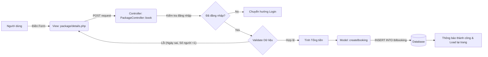
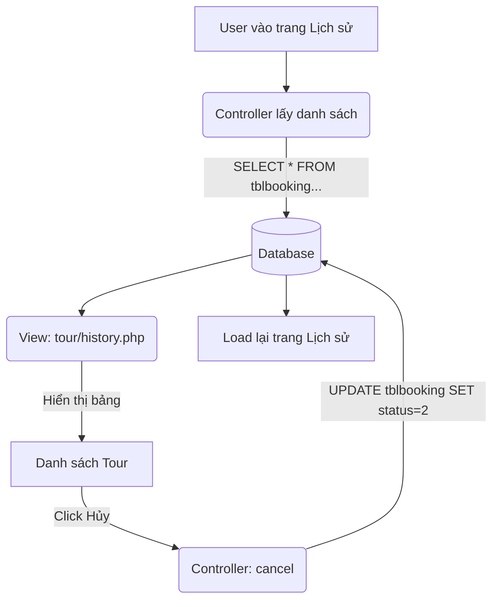
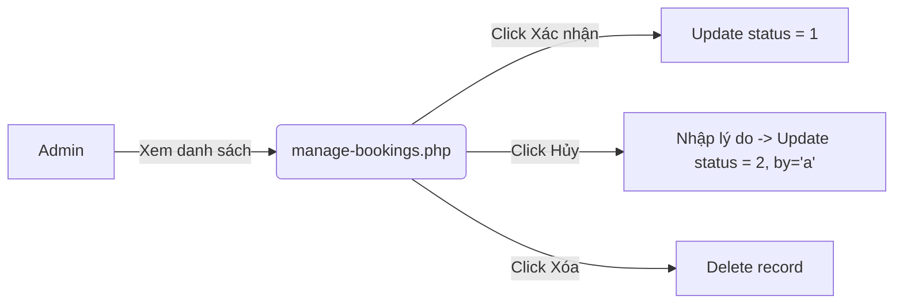

# Hệ Thống Đặt Tour - Tài Liệu Ôn Tập & Giải Thích Code

Tài liệu này giải thích chi tiết cơ chế hoạt động của chức năng Đặt tour, Xem lịch sử và Quản lý Booking trong dự án `tour1`.

## 1. Cơ Sở Dữ Liệu (Database)

Bảng chính lưu trữ thông tin là `tblbooking`.

| Cột | Kiểu dữ liệu | Ý nghĩa |
| :--- | :--- | :--- |
| `BookingId` | int (PK) | Mã định danh đơn đặt tour |
| `PackageId` | int (FK) | Mã gói tour được đặt |
| `UserEmail` | varchar | Email người đặt (liên kết với `tblusers`) |
| `FromDate` | varchar | Ngày khởi hành |
| `ToDate` | varchar | Ngày kết thúc (Hiện tại dự án đang lưu giống FromDate) |
| `NumberOfPeople` | int | Số lượng người đi |
| `TotalPrice` | decimal | Tổng tiền (Giá tour * Số người) |
| `Comment` | mediumtext | Ghi chú của khách hàng |
| `status` | int | 0: Chờ xử lý, 1: Đã xác nhận, 2: Đã hủy |
| `CancelledBy` | varchar | 'u': User hủy, 'a': Admin hủy |
| `CancelReason` | mediumtext | Lý do hủy (nếu có) |
| `CustomerMessage` | mediumtext | Tin nhắn từ admin gửi khách (nếu có) |

---

## 2. Chức Năng: Đặt Tour (User)

Người dùng xem chi tiết gói tour và điền form để đặt chỗ.

### a. Các file liên quan
*   **Giao diện:** `app/views/package/details.php`
*   **Xử lý Logic:** `app/controllers/PackageController.php` (Method: `book`)
*   **Thao tác DB:** `app/models/BookingModel.php` (Method: `createBooking`)

### b. Sơ đồ luồng xử lý


### c. Hướng dẫn tạo Form
Form đặt tour nằm trong file `app/views/package/details.php`.
*   **Phương thức:** `POST`
*   **Action:** `<?php echo BASE_URL; ?>package/book/<?php echo $data["package"]->PackageId; ?>`
*   **Các ô nhập liệu (Input):**

```html
<!-- Input Ngày khởi hành -->
<input type="date" name="departuredate" required>

<!-- Input Số người (giới hạn 1-100) -->
<input type="number" name="numberofpeople" min="1" max="100" value="1" required>

<!-- Textarea Ghi chú -->
<textarea name="comment" required placeholder="Yêu cầu..."></textarea>

<!-- Button Submit -->
<button type="submit" name="submit2">Đặt tour</button>
```

### d. Xử lý Logic (Controller & SQL)
Khi form được submit:
1.  **Controller (`PackageController.php`):**
    *   Kiểm tra `$_SESSION['login']`.
    *   Lấy dữ liệu từ `$_POST`.
    *   Tính tiền: `$totalprice = $package->PackagePrice * $numberofpeople`.
    *   Gọi Model để lưu.
2.  **SQL (`BookingModel.php`):**
    ```sql
    INSERT INTO tblbooking(PackageId, UserEmail, FromDate, ToDate, Comment, NumberOfPeople, TotalPrice, status)
    VALUES (:pid, :useremail, :fromdate, :todate, :comment, :numberofpeople, :totalprice, 0)
    ```
    *Lưu ý: Status mặc định là 0 (Chờ xử lý).*

---

## 3. Chức Năng: Xem Lịch Sử & Hủy Tour (User)

Người dùng xem danh sách các tour đã đặt và có thể hủy nếu chưa đi.

### a. Các file liên quan
*   **Giao diện:** `app/views/tour/history.php`
*   **Xử lý Logic:** `app/controllers/TourController.php` (Code chưa hiển thị nhưng logic nằm ở action `index` và `cancel`)
*   **Thao tác DB:** `app/models/BookingModel.php` (Method: `getBookingsByUserEmail`, `cancelBooking`)

### b. Sơ đồ luồng xử lý


### c. Hiển thị & Logic
*   **Hiển thị:** Sử dụng vòng lặp `foreach` để duyệt qua mảng `$data['bookings']`.
*   **Trạng thái màu sắc:**
    *   `status == 0`: "Đang chờ xử lý" (Class: `is-pending`)
    *   `status == 1`: "Đã xác nhận" (Class: `is-approved`)
    *   `status == 2`: "Đã hủy" (Class: `is-cancelled`). Kiểm tra thêm `cancelby` để biết ai hủy.
*   **Chức năng Hủy:**
    *   Link: `href="<?php echo BASE_URL; ?>tour/cancel/<?php echo $result->bookid; ?>"`
    *   SQL thực thi khi hủy:
        ```sql
        UPDATE tblbooking SET status=2, CancelledBy='u' 
        WHERE UserEmail=:email AND BookingId=:bid
        ```

---

## 4. Chức Năng: Quản Lý Booking (Admin)

Admin xem danh sách, xác nhận hoặc hủy đơn hàng của khách.

### a. Các file liên quan
*   **Giao diện & Logic:** `admin/manage-bookings.php` (Code PHP xử lý nằm ngay đầu file - mô hình cũ, không qua MVC thuần).
*   **Chi tiết:** `admin/view-booking.php`.

### b. Cách thức hoạt động
Admin thao tác trực tiếp trên bảng danh sách.

1.  **Xác nhận Booking:**
    *   Admin nhấn link/button gửi param `bckid` lên URL.
    *   **SQL:**
        ```sql
        UPDATE tblbooking SET status=1 WHERE BookingId=:bcid
        ```

2.  **Hủy Booking (Admin hủy):**
    *   Admin nhấn "Hủy" (thường kèm theo nhập lý do).
    *   Gửi param `bkid` và `cancel_reason`.
    *   **SQL:**
        ```sql
        UPDATE tblbooking SET status=2, CancelledBy='a', CancelReason=:cancelReason 
        WHERE BookingId=:bid
        ```

3.  **Xóa Booking:**
    *   Gửi param `del` lên URL.
    *   **SQL:** `DELETE FROM tblbooking WHERE BookingId=:delid`

### c. Sơ đồ luồng Admin


---

## Tổng kết các biến Status

Để code giao diện chính xác, cần nhớ quy ước:

*   **`0`**: Pending (Chờ admin duyệt) - Màu thường dùng: Vàng/Cam.
*   **`1`**: Confirmed (Đã duyệt) - Màu thường dùng: Xanh lá.
*   **`2`**: Cancelled (Đã hủy) - Màu thường dùng: Đỏ/Xám.
